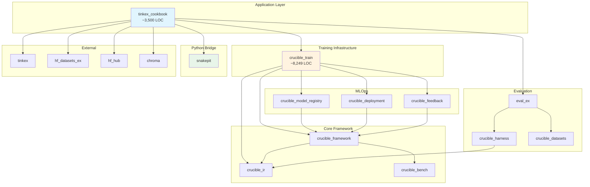

# Library Inventory for TinkexCookbook Facade

**Date:** 2025-12-27

This document catalogs all North-Shore-AI ecosystem libraries required for the thin facade, their roles, and integration points.

---

## Core Dependencies (Required)

### Tier 1: Foundational Layer

| Library | Version | Purpose | Integration Point |
|---------|---------|---------|-------------------|
| `crucible_ir` | ~> 0.2.1 | Intermediate representation specs | `CrucibleIR.Experiment`, `CrucibleIR.Training.Config` |
| `crucible_framework` | ~> 0.5.1 | Pipeline orchestration | `CrucibleFramework.run/2`, `Crucible.Stage` behaviour |
| `crucible_bench` | ~> 0.4.0 | Statistical analysis | Metrics evaluation, effect sizes |

### Tier 2: Training Infrastructure

| Library | Version | Purpose | Integration Point |
|---------|---------|---------|-------------------|
| `crucible_train` | ~> 0.2.0 | **Core training library** | Types, Renderers, Training stages, Ports |

**crucible_train provides:**
- `CrucibleTrain.Types.*` - Datum, ModelInput, TensorData
- `CrucibleTrain.Renderers.*` - Llama3, Qwen3, DeepSeek, etc.
- `CrucibleTrain.Supervised.Train` - Supervised training loop
- `CrucibleTrain.RL.Train` - RL training loop
- `CrucibleTrain.Preference.TrainDPO` - DPO training
- `CrucibleTrain.Distillation.*` - Knowledge distillation
- `CrucibleTrain.Ports.*` - TrainingClient, DatasetStore, etc.
- `CrucibleTrain.Logging.*` - W&B, Neptune, JSON loggers

### Tier 3: MLOps Pipeline (Optional)

| Library | Version | Purpose | Integration Point |
|---------|---------|---------|-------------------|
| `crucible_model_registry` | ~> 0.2.0 | Artifact storage with lineage | Model versioning, checkpoints |
| `crucible_deployment` | ~> 0.2.0 | Multi-target serving | vLLM, Ollama, TGI deployment |
| `crucible_feedback` | ~> 0.1.0 | Production loop management | User feedback collection |
| `crucible_telemetry` | ~> 0.3.0 | Research-grade instrumentation | Metrics streaming |

### Tier 4: Evaluation

| Library | Version | Purpose | Integration Point |
|---------|---------|---------|-------------------|
| `eval_ex` | ~> 0.1.4 | inspect-ai parity | Task, Sample, Scorer abstractions |
| `crucible_harness` | ~> 0.3.2 | Experiment orchestration | Progress tracking, reports |
| `crucible_datasets` | ~> 0.5.3 | Dataset management | GSM8K, HumanEval, MMLU loaders |

### Tier 5: Python Bridge

| Library | Version | Purpose | Integration Point |
|---------|---------|---------|-------------------|
| `snakepit` | ~> 0.8.1 | Elixir-Python gRPC bridge | Python libs in recipes |

---

## External Dependencies (Already in mix.exs)

These remain as direct dependencies in tinkex_cookbook:

| Library | Purpose | Notes |
|---------|---------|-------|
| `tinkex` | Tinker API client | TrainingClient adapter uses this |
| `hf_datasets_ex` | HuggingFace datasets | DatasetStore adapter |
| `hf_hub` | Model hub access | HubClient adapter |
| `chroma` | Vector store | VectorStore adapter |
| `claude_agent_sdk` | Claude CLI agent | LLMClient adapter |
| `codex_sdk` | OpenAI Codex CLI | LLMClient adapter |
| `chz_ex` | CLI config parsing | Recipe configs |
| `ex_aws`, `ex_aws_s3` | Cloud storage | BlobStore adapter |
| `nx` | Tensor operations | Tensor utilities |

---

## Dependency Graph



---

## What Each Library Contributes

### crucible_ir v0.2.1

**Provides:**
```elixir
# Experiment specification
CrucibleIR.Experiment
CrucibleIR.StageDef

# Training configuration
CrucibleIR.Training.Config
CrucibleIR.Training.LRSchedule

# Deployment configuration
CrucibleIR.Deployment.Config
CrucibleIR.Deployment.Target

# Feedback configuration
CrucibleIR.Feedback.Config

# Model references
CrucibleIR.ModelRef
CrucibleIR.ModelVersion
```

**Used by facade:**
- `TinkexCookbook.Runtime.build_spec/2` produces `CrucibleIR.Experiment`
- Recipes output `CrucibleIR.Experiment` for execution

---

### crucible_framework v0.5.1

**Provides:**
```elixir
# Stage behaviour
Crucible.Stage
@callback call(context, opts) :: {:ok, result} | {:error, reason}
@callback describe() :: schema

# Pipeline runner
CrucibleFramework.run(experiment, opts)
CrucibleFramework.Pipeline.Runner

# Context management
CrucibleFramework.Context
```

**Used by facade:**
- `TinkexCookbook.Runtime.run/2` delegates to `CrucibleFramework.run/2`
- Stages in experiments implement `Crucible.Stage`

---

### crucible_train v0.2.0

**Provides:**
```elixir
# Types (DELETE from tinkex_cookbook)
CrucibleTrain.Types.Datum
CrucibleTrain.Types.ModelInput
CrucibleTrain.Types.TensorData
CrucibleTrain.Types.TokensWithLogprobs

# Renderers (DELETE from tinkex_cookbook)
CrucibleTrain.Renderers.Llama3
CrucibleTrain.Renderers.Qwen3
CrucibleTrain.Renderers.DeepSeekV3
CrucibleTrain.Renderers.KimiK2
CrucibleTrain.Renderers.GptOss
CrucibleTrain.Renderers.Registry

# Training stages (DELETE from tinkex_cookbook)
CrucibleTrain.Stages.SupervisedTrain
CrucibleTrain.Stages.RLTrain
CrucibleTrain.Stages.DPOTrain
CrucibleTrain.Stages.Distillation

# Ports (CRITICAL - add to tinkex_cookbook adapters)
CrucibleTrain.Ports.TrainingClient
CrucibleTrain.Ports.DatasetStore
CrucibleTrain.Ports.HubClient
CrucibleTrain.Ports.BlobStore
CrucibleTrain.Ports.LLMClient
CrucibleTrain.Ports.EmbeddingClient
CrucibleTrain.Ports.VectorStore

# Logging
CrucibleTrain.Logging.WandbLogger
CrucibleTrain.Logging.NeptuneLogger
CrucibleTrain.Logging.JSONLogger
```

**Used by facade:**
- Recipes use `CrucibleTrain.Types.*` for data structures
- Recipes reference `CrucibleTrain.Renderers.*` in config
- Experiments include `CrucibleTrain.Stages.*` for training
- Adapters implement `CrucibleTrain.Ports.*` behaviours

---

### snakepit v0.8.1

**Provides:**
```elixir
# Core API
Snakepit.execute(pool, tool, args)
Snakepit.execute_stream(pool, tool, args, callback)

# Session management
Snakepit.Bridge.SessionStore
Snakepit.Bridge.Session

# Pool management
Snakepit.Pool
Snakepit.GRPCWorker

# Hardware detection
Snakepit.Hardware.detect()
```

**Python libs accessed:**
- `sympy` - Symbolic math
- `pylatexenc` - LaTeX processing
- `math_verify` - Math verification

**Used by recipes:**
- Math verification recipes call Snakepit for Python computations
- NOT used in the core facade - only in specific recipes

---

## Updated mix.exs

After transformation, the deps section should be:

```elixir
defp deps do
  [
    # Core North-Shore-AI ecosystem
    {:crucible_ir, "~> 0.2.1"},
    {:crucible_framework, "~> 0.5.1"},
    {:crucible_train, "~> 0.2.0"},  # NEW - replaces local training code
    {:crucible_bench, "~> 0.4.0"},

    # Evaluation
    {:crucible_harness, "~> 0.3.2"},
    {:crucible_datasets, "~> 0.5.3"},
    {:eval_ex, "~> 0.1.4"},

    # Python bridge (for recipes needing Python libs)
    {:snakepit, "~> 0.8.1"},  # NEW - replaces snakebridge

    # Tinker API client
    {:tinkex, "~> 0.3.4"},

    # HuggingFace ecosystem (for adapters)
    {:hf_datasets_ex, "~> 0.1.1"},
    {:hf_hub, "~> 0.1"},

    # LLM agent SDKs (for LLM adapters)
    {:claude_agent_sdk, "~> 0.6.8"},
    {:codex_sdk, "~> 0.4.2"},

    # Vector store (for adapters)
    {:chroma, "~> 0.1.2"},

    # Configuration + CLI parsing
    {:chz_ex, "~> 0.1.2"},

    # Cloud storage (for blob adapters)
    {:ex_aws, "~> 2.5"},
    {:ex_aws_s3, "~> 2.5"},

    # Utilities
    {:nx, "~> 0.9"},
    {:table_rex, "~> 4.0"},

    # Dev/Test
    {:ex_doc, "~> 0.31", only: :dev, runtime: false},
    {:dialyxir, "~> 1.4", only: [:dev, :test], runtime: false},
    {:credo, "~> 1.7", only: [:dev, :test], runtime: false},
    {:mox, "~> 1.0", only: :test}
  ]
end
```

---

## Removed Dependencies

These are no longer needed as crucible_train provides them:

| Removed | Replaced By |
|---------|-------------|
| `snakebridge` | `snakepit` (more capable) |
| `sinter` | crucible_train types |
| `gemini_ex` | Optional, keep if needed for specific adapters |
| `openai_ex` | Optional, keep if needed for specific adapters |

---

## Version Compatibility Matrix

| Library A | Version | Library B | Version | Notes |
|-----------|---------|-----------|---------|-------|
| crucible_train | 0.2.0+ | crucible_framework | 0.5.1+ | Required |
| crucible_train | 0.2.0+ | crucible_ir | 0.2.1+ | Required |
| crucible_framework | 0.5.1+ | crucible_ir | 0.2.1+ | Required |
| eval_ex | 0.1.4+ | crucible_harness | 0.3.2+ | Required |
| snakepit | 0.8.1+ | Python | 3.10+ | Required for free-threading: 3.13+ |
