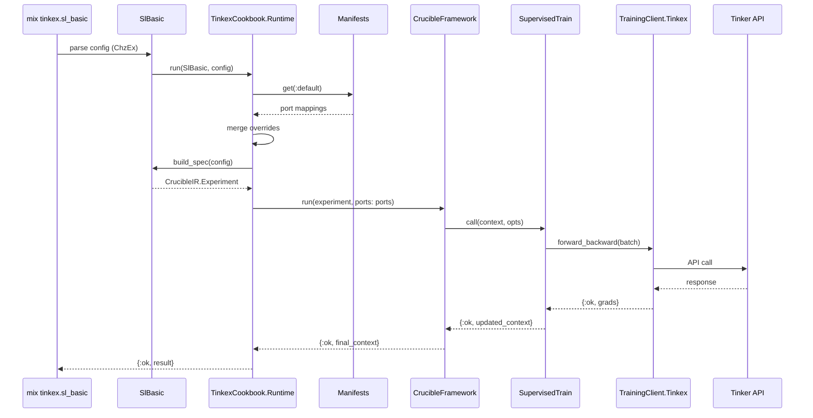

# Facade Architecture Design

**Date:** 2025-12-27

This document details the hexagonal architecture design for the TinkexCookbook facade, including the Runtime module, ports system, and adapter wiring.

---

## Architecture Overview

```
┌─────────────────────────────────────────────────────────────────────┐
│                        TinkexCookbook                                │
│  ┌───────────────────────────────────────────────────────────────┐  │
│  │                    TinkexCookbook.Runtime                      │  │
│  │  ┌─────────────┐  ┌─────────────┐  ┌─────────────────────┐   │  │
│  │  │ build_spec  │  │    run      │  │    build_ports      │   │  │
│  │  └──────┬──────┘  └──────┬──────┘  └──────────┬──────────┘   │  │
│  │         │                │                     │               │  │
│  │         ▼                ▼                     ▼               │  │
│  │  ┌──────────────────────────────────────────────────────┐    │  │
│  │  │              Port Resolution Layer                     │    │  │
│  │  │  ┌──────────┐ ┌──────────┐ ┌──────────┐ ┌──────────┐ │    │  │
│  │  │  │Training  │ │Dataset   │ │  Blob    │ │   Hub    │ │    │  │
│  │  │  │Client    │ │Store     │ │  Store   │ │  Client  │ │    │  │
│  │  │  └────┬─────┘ └────┬─────┘ └────┬─────┘ └────┬─────┘ │    │  │
│  │  └───────┼────────────┼────────────┼────────────┼───────┘    │  │
│  └──────────┼────────────┼────────────┼────────────┼────────────┘  │
│             │            │            │            │                │
│  ┌──────────▼────────────▼────────────▼────────────▼────────────┐  │
│  │                    Adapters Layer                              │  │
│  │  ┌─────────────┐  ┌─────────────┐  ┌─────────────────────┐   │  │
│  │  │   Tinkex    │  │HfDatasets   │  │  Local │ S3         │   │  │
│  │  │TrainingClient│  │DatasetStore │  │BlobStore│ BlobStore │   │  │
│  │  └──────┬──────┘  └──────┬──────┘  └─────┬───┴─────┬─────┘   │  │
│  │         │                │               │         │          │  │
│  └─────────┼────────────────┼───────────────┼─────────┼──────────┘  │
│            │                │               │         │             │
└────────────┼────────────────┼───────────────┼─────────┼─────────────┘
             │                │               │         │
             ▼                ▼               ▼         ▼
     ┌───────────┐    ┌────────────┐   ┌─────────┐  ┌─────────┐
     │  Tinker   │    │ HuggingFace│   │  Local  │  │   S3    │
     │   API     │    │    API     │   │Filesystem│  │   API   │
     └───────────┘    └────────────┘   └─────────┘  └─────────┘
```

---

## Core Module: TinkexCookbook.Runtime

The Runtime module is the single entrypoint for all recipe execution. It implements the Unified Facade pattern.

### API Surface

```elixir
defmodule TinkexCookbook.Runtime do
  @moduledoc """
  Unified facade for TinkexCookbook recipe execution.

  This is the ONLY entrypoint for running recipes. All recipes
  delegate to this module, which handles port resolution,
  experiment building, and execution via CrucibleFramework.
  """

  @type manifest_name :: :default | :local | :dev | :prod | :test | atom()
  @type run_opts :: [
    manifest: manifest_name(),
    ports: map(),
    dry_run: boolean(),
    verbose: boolean()
  ]

  @doc """
  Build a CrucibleIR.Experiment from a recipe and config.

  The recipe must implement the Recipe behaviour.
  """
  @spec build_spec(module(), map() | struct()) :: CrucibleIR.Experiment.t()
  def build_spec(recipe_module, config) do
    recipe_module.build_spec(config)
  end

  @doc """
  Run a recipe with the given config.

  This is the primary entrypoint. It:
  1. Resolves ports via manifest + overrides
  2. Builds the experiment spec via recipe.build_spec/1
  3. Executes via CrucibleFramework.run/2
  """
  @spec run(module(), map() | struct(), run_opts()) ::
    {:ok, CrucibleFramework.Context.t()} | {:error, term()}
  def run(recipe_module, config, opts \\ []) do
    manifest = Keyword.get(opts, :manifest, :default)
    port_overrides = Keyword.get(opts, :ports, %{})

    with {:ok, ports} <- build_ports(manifest, port_overrides),
         experiment <- recipe_module.build_spec(config),
         {:ok, context} <- CrucibleFramework.run(experiment, ports: ports) do
      {:ok, context}
    end
  end

  @doc """
  Low-level entrypoint for external orchestration.

  Accepts a pre-built CrucibleIR.Experiment and runs it.
  """
  @spec run_spec(CrucibleIR.Experiment.t(), run_opts()) ::
    {:ok, CrucibleFramework.Context.t()} | {:error, term()}
  def run_spec(experiment, opts \\ []) do
    manifest = Keyword.get(opts, :manifest, :default)
    port_overrides = Keyword.get(opts, :ports, %{})

    with {:ok, ports} <- build_ports(manifest, port_overrides) do
      CrucibleFramework.run(experiment, ports: ports)
    end
  end

  @doc """
  Build ports map from manifest and overrides.
  """
  @spec build_ports(manifest_name(), map()) :: {:ok, map()} | {:error, term()}
  def build_ports(manifest_name, overrides \\ %{}) do
    defaults = TinkexCookbook.Runtime.Manifests.defaults()
    manifest = TinkexCookbook.Runtime.Manifests.get(manifest_name)

    ports =
      defaults
      |> Map.merge(manifest)
      |> Map.merge(overrides)

    {:ok, ports}
  end

  @doc """
  Convenience wrapper for training-only pipelines.
  """
  @spec train(module(), map(), run_opts()) ::
    {:ok, CrucibleFramework.Context.t()} | {:error, term()}
  def train(recipe_module, config, opts \\ []) do
    run(recipe_module, config, opts)
  end

  @doc """
  Convenience wrapper for evaluation pipelines.
  """
  @spec eval(module(), map(), run_opts()) ::
    {:ok, CrucibleFramework.Context.t()} | {:error, term()}
  def eval(recipe_module, config, opts \\ []) do
    run(recipe_module, config, opts)
  end
end
```

---

## Port System Design

### Port Behaviours (from crucible_train)

TinkexCookbook adapters implement these behaviours:

```elixir
# CrucibleTrain.Ports.TrainingClient
@callback start_session(model, config) :: {:ok, session} | {:error, reason}
@callback forward_backward(session, batch) :: {:ok, grads} | {:error, reason}
@callback optim_step(session, grads, lr) :: :ok | {:error, reason}
@callback checkpoint_save(session, path) :: :ok | {:error, reason}
@callback checkpoint_load(session, path) :: {:ok, session} | {:error, reason}
@callback await(session, timeout) :: {:ok, result} | {:error, reason}

# CrucibleTrain.Ports.DatasetStore
@callback load(dataset_name, split, opts) :: {:ok, stream} | {:error, reason}
@callback info(dataset_name) :: {:ok, info} | {:error, reason}

# CrucibleTrain.Ports.BlobStore
@callback read(path) :: {:ok, binary} | {:error, reason}
@callback write(path, content) :: :ok | {:error, reason}
@callback exists?(path) :: boolean()
@callback list(prefix) :: {:ok, [path]} | {:error, reason}

# CrucibleTrain.Ports.HubClient
@callback download(repo_id, filename, opts) :: {:ok, path} | {:error, reason}
@callback upload(repo_id, local_path, remote_path, opts) :: :ok | {:error, reason}
@callback model_info(repo_id) :: {:ok, info} | {:error, reason}

# CrucibleTrain.Ports.LLMClient
@callback chat(messages, opts) :: {:ok, response} | {:error, reason}
@callback stream_chat(messages, opts, callback) :: {:ok, final} | {:error, reason}

# CrucibleTrain.Ports.EmbeddingClient
@callback embed(texts, opts) :: {:ok, embeddings} | {:error, reason}

# CrucibleTrain.Ports.VectorStore
@callback add(collection, embeddings, metadata) :: :ok | {:error, reason}
@callback query(collection, embedding, k) :: {:ok, results} | {:error, reason}
```

---

## Manifests System

Manifests provide environment-specific port wiring:

```elixir
defmodule TinkexCookbook.Runtime.Manifests do
  @moduledoc """
  Environment-specific port manifests.

  Manifests are named configurations that wire ports to specific
  adapter implementations. This enables environment-specific behavior
  without changing recipe code.
  """

  alias TinkexCookbook.Adapters

  @doc "Default port implementations"
  def defaults do
    %{
      "training_client" => Adapters.TrainingClient.Tinkex,
      "dataset_store" => Adapters.DatasetStore.HfDatasets,
      "blob_store" => Adapters.BlobStore.Local,
      "hub_client" => Adapters.HubClient.HfHub,
      "llm_client" => Adapters.LLMClient.Noop,
      "embedding_client" => Adapters.EmbeddingClient.Noop,
      "vector_store" => Adapters.VectorStore.Noop
    }
  end

  @doc "Get named manifest"
  def get(:default), do: %{}

  def get(:local) do
    %{
      "blob_store" => Adapters.BlobStore.Local
    }
  end

  def get(:prod) do
    %{
      "blob_store" => Adapters.BlobStore.S3,
      "llm_client" => Adapters.LLMClient.ClaudeAgent
    }
  end

  def get(:test) do
    %{
      "training_client" => Adapters.TrainingClient.Noop,
      "dataset_store" => Adapters.DatasetStore.Noop,
      "blob_store" => Adapters.BlobStore.Noop,
      "hub_client" => Adapters.HubClient.Noop,
      "llm_client" => Adapters.LLMClient.Noop,
      "embedding_client" => Adapters.EmbeddingClient.Noop,
      "vector_store" => Adapters.VectorStore.Noop
    }
  end

  def get(name), do: raise "Unknown manifest: #{inspect(name)}"
end
```

---

## Adapter Implementations

### TrainingClient.Tinkex

The critical adapter that wraps the Tinkex API:

```elixir
defmodule TinkexCookbook.Adapters.TrainingClient.Tinkex do
  @moduledoc """
  TrainingClient adapter for the Tinker ML platform.

  Implements CrucibleTrain.Ports.TrainingClient using
  the Tinkex API client.
  """

  @behaviour CrucibleTrain.Ports.TrainingClient

  alias Tinkex.TrainingClient, as: Client

  @impl true
  def start_session(model, config) do
    opts = [
      model: model,
      learning_rate: config.learning_rate,
      optimizer: config.optimizer,
      lora_rank: config.lora_rank
    ]

    case Client.create_session(opts) do
      {:ok, session_id} -> {:ok, %{id: session_id, model: model}}
      {:error, reason} -> {:error, {:session_start_failed, reason}}
    end
  end

  @impl true
  def forward_backward(session, batch) do
    Client.forward_backward(session.id, batch)
  end

  @impl true
  def optim_step(session, grads, lr) do
    Client.optim_step(session.id, grads, lr)
  end

  @impl true
  def checkpoint_save(session, path) do
    Client.save_checkpoint(session.id, path)
  end

  @impl true
  def checkpoint_load(session, path) do
    with {:ok, _} <- Client.load_checkpoint(session.id, path) do
      {:ok, session}
    end
  end

  @impl true
  def await(session, timeout \\ 30_000) do
    Client.await(session.id, timeout)
  end
end
```

### DatasetStore.HfDatasets

```elixir
defmodule TinkexCookbook.Adapters.DatasetStore.HfDatasets do
  @moduledoc """
  DatasetStore adapter using HuggingFace datasets.
  """

  @behaviour CrucibleTrain.Ports.DatasetStore

  alias HfDatasetsEx.Dataset

  @impl true
  def load(dataset_name, split, opts \\ []) do
    case Dataset.load(dataset_name, split: split, streaming: true) do
      {:ok, stream} -> {:ok, stream}
      {:error, reason} -> {:error, {:dataset_load_failed, reason}}
    end
  end

  @impl true
  def info(dataset_name) do
    Dataset.info(dataset_name)
  end
end
```

---

## Recipe Behaviour

All recipes implement this behaviour:

```elixir
defmodule TinkexCookbook.Recipe do
  @moduledoc """
  Behaviour for TinkexCookbook recipes.

  Recipes are orchestration units that define:
  - A name and description
  - A configuration schema (ChzEx)
  - How to build a CrucibleIR.Experiment from config
  """

  @doc "Unique recipe name"
  @callback name() :: String.t()

  @doc "Human-readable description"
  @callback description() :: String.t()

  @doc "ChzEx config schema module"
  @callback config_schema() :: module()

  @doc "Build experiment spec from config"
  @callback build_spec(config :: struct() | map()) :: CrucibleIR.Experiment.t()

  @doc "Default configuration values"
  @callback default_config() :: map()

  @optional_callbacks [default_config: 0]
end
```

### Example Recipe: sl_basic

```elixir
defmodule TinkexCookbook.Recipes.SlBasic do
  @moduledoc """
  Basic supervised learning recipe.

  This is the reference implementation showing how recipes
  should delegate to crucible_train stages.
  """

  @behaviour TinkexCookbook.Recipe

  alias CrucibleIR.{Experiment, StageDef}
  alias CrucibleTrain.Stages.SupervisedTrain
  alias TinkexCookbook.Recipes.SlBasicConfig

  @impl true
  def name, do: "sl_basic"

  @impl true
  def description, do: "Basic supervised fine-tuning recipe"

  @impl true
  def config_schema, do: SlBasicConfig

  @impl true
  def build_spec(config) do
    %Experiment{
      name: "sl_basic_#{config.model}",
      description: description(),
      stages: [
        %StageDef{
          name: "train",
          module: SupervisedTrain,
          options: %{
            model: config.model,
            dataset: config.dataset,
            num_epochs: config.num_epochs,
            learning_rate: config.learning_rate,
            batch_size: config.batch_size,
            renderer: config.renderer,
            train_on: config.train_on
          }
        }
      ]
    }
  end

  @impl true
  def default_config do
    %{
      model: "meta-llama/Llama-3.2-1B",
      dataset: "no_robots",
      num_epochs: 1,
      learning_rate: 1.0e-5,
      batch_size: 16,
      renderer: :llama3,
      train_on: :all_assistant_messages
    }
  end
end
```

---

## Execution Flow Diagram



---

## Module Layout

```
lib/tinkex_cookbook/
├── runtime/
│   ├── runtime.ex              # TinkexCookbook.Runtime
│   └── manifests.ex            # Port manifest definitions
├── recipes/
│   ├── behaviour.ex            # TinkexCookbook.Recipe behaviour
│   ├── sl_basic.ex             # Supervised learning
│   ├── sl_basic_config.ex      # ChzEx config schema
│   ├── rl_grpo.ex              # RL with GRPO
│   ├── dpo.ex                  # Direct Preference Optimization
│   └── distill.ex              # Knowledge distillation
├── adapters/
│   ├── training_client/
│   │   ├── tinkex.ex           # Tinkex API adapter
│   │   └── noop.ex             # Test stub
│   ├── dataset_store/
│   │   ├── hf_datasets.ex      # HuggingFace datasets
│   │   └── noop.ex
│   ├── blob_store/
│   │   ├── local.ex            # Local filesystem
│   │   ├── s3.ex               # S3 storage
│   │   └── noop.ex
│   ├── hub_client/
│   │   ├── hf_hub.ex           # HuggingFace hub
│   │   └── noop.ex
│   ├── llm_client/
│   │   ├── claude_agent.ex     # Claude Agent SDK
│   │   ├── codex.ex            # Codex SDK
│   │   └── noop.ex
│   ├── embedding_client/
│   │   └── noop.ex
│   └── vector_store/
│       ├── chroma.ex           # ChromaDB
│       └── noop.ex
├── cli/
│   └── sl_basic.ex             # Mix.Tasks.Tinkex.SlBasic
├── eval/
│   ├── runner.ex               # Evaluation runner
│   └── tinkex_generate.ex      # Generate via Tinkex
└── tinkex_cookbook.ex          # Top-level module
```

---

## Port Injection Mechanism

Ports are injected into stages via context assigns:

```elixir
# In CrucibleFramework, ports are available via context
defmodule CrucibleTrain.Stages.SupervisedTrain do
  @behaviour Crucible.Stage

  @impl true
  def call(context, opts) do
    # Get port from context
    training_client = context.assigns.ports["training_client"]
    dataset_store = context.assigns.ports["dataset_store"]

    # Use ports
    {:ok, data_stream} = dataset_store.load(opts.dataset, :train)
    {:ok, session} = training_client.start_session(opts.model, opts)

    # Training loop using ports...
  end
end
```

---

## Testing Strategy

With hexagonal architecture, testing becomes straightforward:

```elixir
defmodule TinkexCookbook.Recipes.SlBasicTest do
  use ExUnit.Case

  alias TinkexCookbook.Runtime
  alias TinkexCookbook.Recipes.SlBasic

  test "runs sl_basic with noop adapters" do
    config = %{
      model: "test-model",
      dataset: "test-dataset",
      num_epochs: 1
    }

    # Use test manifest with noop adapters
    {:ok, result} = Runtime.run(SlBasic, config, manifest: :test)

    assert result.assigns.completed_stages == ["train"]
  end

  test "build_spec produces valid experiment" do
    config = SlBasic.default_config()
    experiment = SlBasic.build_spec(config)

    assert experiment.name =~ "sl_basic"
    assert length(experiment.stages) == 1
    assert hd(experiment.stages).module == CrucibleTrain.Stages.SupervisedTrain
  end
end
```
