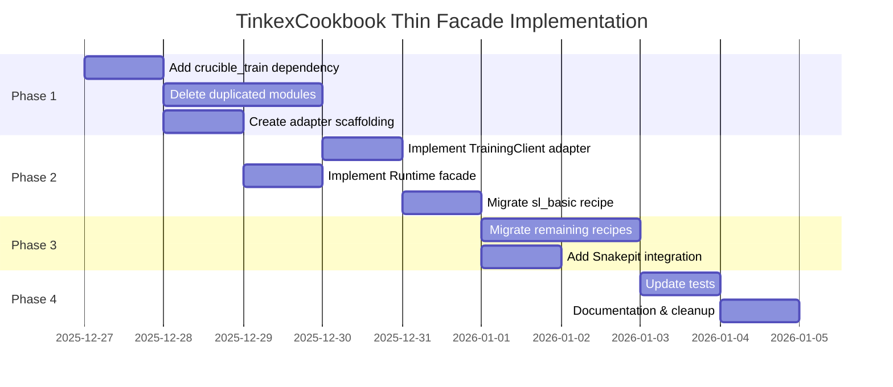

# Implementation Roadmap

**Date:** 2025-12-27

This document provides a detailed, step-by-step implementation plan for transforming tinkex_cookbook into a thin facade.

NOTE: Superseded by the corrected ownership model. Adapter implementations now
live in `crucible_kitchen`; TinkexCookbook provides recipes/config only.

---

## Phase Overview



---

## Phase 1: Foundation (Day 1-3)

### Step 1.1: Add crucible_train Dependency

**File:** `mix.exs`

```elixir
# Add to deps
{:crucible_train, "~> 0.2.0"},
{:snakepit, "~> 0.8.1"},  # Replace snakebridge
```

**Commands:**
```bash
cd /home/home/p/g/North-Shore-AI/tinkex_cookbook
mix deps.get
mix compile
```

**Verification:**
```elixir
# In iex
iex> CrucibleTrain.Types.Datum
CrucibleTrain.Types.Datum
iex> CrucibleTrain.Renderers.Llama3
CrucibleTrain.Renderers.Llama3
```

---

### Step 1.2: Delete Duplicated Modules

These modules are now provided by crucible_train and must be deleted:

| Module | Path | Replacement |
|--------|------|-------------|
| Types | `lib/tinkex_cookbook/types.ex` | `CrucibleTrain.Types` |
| Types.Datum | `lib/tinkex_cookbook/types/datum.ex` | `CrucibleTrain.Types.Datum` |
| Types.ModelInput | `lib/tinkex_cookbook/types/model_input.ex` | `CrucibleTrain.Types.ModelInput` |
| Types.TensorData | `lib/tinkex_cookbook/types/tensor_data.ex` | `CrucibleTrain.Types.TensorData` |
| Renderers | `lib/tinkex_cookbook/renderers.ex` | `CrucibleTrain.Renderers` |
| Renderers.* | `lib/tinkex_cookbook/renderers/*.ex` | `CrucibleTrain.Renderers.*` |
| Supervised.Train | `lib/tinkex_cookbook/supervised/train.ex` | `CrucibleTrain.Supervised.Train` |
| Supervised.Config | `lib/tinkex_cookbook/supervised/config.ex` | `CrucibleTrain.Supervised.Config` |
| Supervised.Common | `lib/tinkex_cookbook/supervised/common.ex` | DELETE |
| Supervised.Dataset | `lib/tinkex_cookbook/supervised/dataset.ex` | DELETE |
| RL.* | `lib/tinkex_cookbook/rl/*.ex` | `CrucibleTrain.RL.*` |
| Preference.* | `lib/tinkex_cookbook/preference/*.ex` | `CrucibleTrain.Preference.*` |
| Distillation.* | `lib/tinkex_cookbook/distillation/*.ex` | `CrucibleTrain.Distillation.*` |
| Completers.* | `lib/tinkex_cookbook/completers/*.ex` | `CrucibleTrain.Completers.*` |
| Utils.LrScheduling | `lib/tinkex_cookbook/utils/lr_scheduling.ex` | `CrucibleTrain.Utils.LRScheduling` |
| Utils.Logtree | `lib/tinkex_cookbook/utils/logtree.ex` | `CrucibleTrain.Utils.Logtree` |

**Script to delete:**
```bash
cd /home/home/p/g/North-Shore-AI/tinkex_cookbook

# Types
rm lib/tinkex_cookbook/types.ex
rm -rf lib/tinkex_cookbook/types/

# Renderers
rm lib/tinkex_cookbook/renderers.ex
rm -rf lib/tinkex_cookbook/renderers/

# Training modules
rm -rf lib/tinkex_cookbook/supervised/
rm -rf lib/tinkex_cookbook/rl/
rm -rf lib/tinkex_cookbook/preference/
rm -rf lib/tinkex_cookbook/distillation/
rm -rf lib/tinkex_cookbook/completers/

# Duplicated utils
rm lib/tinkex_cookbook/utils/lr_scheduling.ex
rm lib/tinkex_cookbook/utils/logtree.ex
rm lib/tinkex_cookbook/utils/logtree_formatters.ex
rm lib/tinkex_cookbook/utils/parity.ex
rm lib/tinkex_cookbook/utils/trace.ex
```

---

### Step 1.3: Create Adapter Scaffolding

**Create directory structure:**
```bash
mkdir -p lib/tinkex_cookbook/runtime
mkdir -p lib/tinkex_cookbook/adapters/training_client
mkdir -p lib/tinkex_cookbook/adapters/dataset_store
mkdir -p lib/tinkex_cookbook/adapters/blob_store
mkdir -p lib/tinkex_cookbook/adapters/hub_client
mkdir -p lib/tinkex_cookbook/adapters/llm_client
mkdir -p lib/tinkex_cookbook/adapters/embedding_client
mkdir -p lib/tinkex_cookbook/adapters/vector_store
mkdir -p lib/tinkex_cookbook/python
```

**Move existing adapters:**
```bash
# These already exist, just reorganize
mv lib/tinkex_cookbook/adapters/dataset_store/hf_datasets.ex \
   lib/tinkex_cookbook/adapters/dataset_store/hf_datasets.ex

mv lib/tinkex_cookbook/adapters/hub_client/hf_hub.ex \
   lib/tinkex_cookbook/adapters/hub_client/hf_hub.ex
```

---

## Phase 2: Core Implementation (Day 3-5)

### Step 2.1: Implement TrainingClient.Tinkex Adapter

**File:** `lib/tinkex_cookbook/adapters/training_client/tinkex.ex`

```elixir
defmodule TinkexCookbook.Adapters.TrainingClient.Tinkex do
  @behaviour CrucibleTrain.Ports.TrainingClient

  alias Tinkex.TrainingClient, as: Client

  @impl true
  def start_session(model, config) do
    opts = build_session_opts(model, config)
    case Client.create_session(opts) do
      {:ok, session_id} ->
        {:ok, %{
          id: session_id,
          model: model,
          config: config
        }}
      {:error, reason} ->
        {:error, {:session_start_failed, reason}}
    end
  end

  @impl true
  def forward_backward(session, batch) do
    Client.forward_backward(session.id, batch)
  end

  @impl true
  def optim_step(session, grads, lr) do
    Client.optim_step(session.id, grads, lr)
  end

  @impl true
  def checkpoint_save(session, path) do
    Client.save_checkpoint(session.id, path)
  end

  @impl true
  def checkpoint_load(session, path) do
    case Client.load_checkpoint(session.id, path) do
      {:ok, _} -> {:ok, session}
      error -> error
    end
  end

  @impl true
  def await(session, timeout \\ 30_000) do
    Client.await(session.id, timeout)
  end

  defp build_session_opts(model, config) do
    [
      model: model,
      learning_rate: Map.get(config, :learning_rate, 1.0e-5),
      optimizer: Map.get(config, :optimizer, :adamw),
      lora_rank: Map.get(config, :lora_rank, 16),
      batch_size: Map.get(config, :batch_size, 16)
    ]
  end
end
```

---

### Step 2.2: Implement Runtime Facade

**File:** `lib/tinkex_cookbook/runtime/runtime.ex`

```elixir
defmodule TinkexCookbook.Runtime do
  @moduledoc """
  Unified facade for TinkexCookbook recipe execution.
  """

  alias TinkexCookbook.Runtime.Manifests

  @type manifest_name :: :default | :local | :dev | :prod | :test | atom()
  @type run_opts :: [
    manifest: manifest_name(),
    ports: map(),
    dry_run: boolean()
  ]

  @spec run(module(), map() | struct(), run_opts()) ::
    {:ok, map()} | {:error, term()}
  def run(recipe_module, config, opts \\ []) do
    manifest = Keyword.get(opts, :manifest, :default)
    port_overrides = Keyword.get(opts, :ports, %{})

    with {:ok, ports} <- build_ports(manifest, port_overrides),
         experiment <- recipe_module.build_spec(config) do
      CrucibleFramework.run(experiment, ports: ports)
    end
  end

  @spec build_ports(manifest_name(), map()) :: {:ok, map()}
  def build_ports(manifest_name, overrides \\ %{}) do
    ports =
      Manifests.defaults()
      |> Map.merge(Manifests.get(manifest_name))
      |> Map.merge(overrides)

    {:ok, ports}
  end

  @spec build_spec(module(), map()) :: CrucibleIR.Experiment.t()
  def build_spec(recipe_module, config) do
    recipe_module.build_spec(config)
  end
end
```

**File:** `lib/tinkex_cookbook/runtime/manifests.ex`

```elixir
defmodule TinkexCookbook.Runtime.Manifests do
  @moduledoc """
  Environment-specific port wiring manifests.
  """

  alias TinkexCookbook.Adapters

  def defaults do
    %{
      "training_client" => Adapters.TrainingClient.Tinkex,
      "dataset_store" => Adapters.DatasetStore.HfDatasets,
      "blob_store" => Adapters.BlobStore.Local,
      "hub_client" => Adapters.HubClient.HfHub,
      "llm_client" => Adapters.LLMClient.Noop,
      "embedding_client" => Adapters.EmbeddingClient.Noop,
      "vector_store" => Adapters.VectorStore.Noop
    }
  end

  def get(:default), do: %{}
  def get(:local), do: %{"blob_store" => Adapters.BlobStore.Local}
  def get(:prod), do: %{"blob_store" => Adapters.BlobStore.S3}
  def get(:test) do
    %{
      "training_client" => Adapters.TrainingClient.Noop,
      "dataset_store" => Adapters.DatasetStore.Noop,
      "blob_store" => Adapters.BlobStore.Noop,
      "hub_client" => Adapters.HubClient.Noop,
      "llm_client" => Adapters.LLMClient.Noop,
      "embedding_client" => Adapters.EmbeddingClient.Noop,
      "vector_store" => Adapters.VectorStore.Noop
    }
  end
  def get(name), do: raise "Unknown manifest: #{inspect(name)}"
end
```

---

### Step 2.3: Migrate sl_basic Recipe

**File:** `lib/tinkex_cookbook/recipes/sl_basic.ex` (rewrite)

```elixir
defmodule TinkexCookbook.Recipes.SlBasic do
  @behaviour TinkexCookbook.Recipe

  alias CrucibleIR.{Experiment, StageDef}
  alias CrucibleTrain.Stages.SupervisedTrain

  @impl true
  def name, do: "sl_basic"

  @impl true
  def description, do: "Basic supervised fine-tuning"

  @impl true
  def config_schema, do: TinkexCookbook.Recipes.SlBasicConfig

  @impl true
  def build_spec(config) do
    %Experiment{
      name: "sl_basic_#{config.model}",
      description: description(),
      stages: [
        %StageDef{
          name: "supervised_train",
          module: SupervisedTrain,
          options: %{
            model: config.model,
            dataset: config.dataset,
            num_epochs: config.num_epochs,
            learning_rate: config.learning_rate,
            batch_size: config.batch_size,
            renderer: resolve_renderer(config.renderer),
            train_on: config.train_on
          }
        }
      ]
    }
  end

  @impl true
  def default_config do
    %{
      model: "meta-llama/Llama-3.2-1B",
      dataset: "no_robots",
      num_epochs: 1,
      learning_rate: 1.0e-5,
      batch_size: 16,
      renderer: :llama3,
      train_on: :all_assistant_messages
    }
  end

  defp resolve_renderer(:llama3), do: CrucibleTrain.Renderers.Llama3
  defp resolve_renderer(:qwen3), do: CrucibleTrain.Renderers.Qwen3
  defp resolve_renderer(:deepseek_v3), do: CrucibleTrain.Renderers.DeepSeekV3
  defp resolve_renderer(module) when is_atom(module), do: module
end
```

---

## Phase 3: Complete Migration (Day 5-7)

### Step 3.1: Migrate Remaining Recipes

| Recipe | Stage Module | Notes |
|--------|--------------|-------|
| `rl_grpo` | `CrucibleTrain.Stages.RLTrain` | RL with GRPO |
| `dpo` | `CrucibleTrain.Stages.DPOTrain` | Direct Preference Optimization |
| `distill` | `CrucibleTrain.Stages.Distillation` | Knowledge distillation |

Each follows the same pattern as sl_basic - just reference the appropriate stage.

---

### Step 3.2: Add Snakepit Integration

**File:** `lib/tinkex_cookbook/python/math.ex`

```elixir
defmodule TinkexCookbook.Python.Math do
  @pool :math_pool

  def verify_answer(reference, prediction, tolerance \\ 1.0e-6) do
    Snakepit.execute(@pool, "verify_math_answer", %{
      reference: reference,
      prediction: prediction,
      tolerance: tolerance
    })
  end

  def batch_verify(pairs, tolerance \\ 1.0e-6) do
    Snakepit.execute(@pool, "batch_verify", %{
      pairs: pairs,
      tolerance: tolerance
    })
  end
end
```

**Create Python adapter:**
```bash
mkdir -p priv/python/snakepit_bridge/adapters/math
# Create math_adapter.py as shown in 03_SNAKEPIT_INTEGRATION.md
```

---

## Phase 4: Testing & Cleanup (Day 7-8)

### Step 4.1: Update Tests

**Update test helpers:**
```elixir
# test/support/test_helpers.ex
defmodule TinkexCookbook.TestHelpers do
  def run_with_mocks(recipe, config) do
    TinkexCookbook.Runtime.run(recipe, config, manifest: :test)
  end
end
```

**Update recipe tests:**
```elixir
defmodule TinkexCookbook.Recipes.SlBasicTest do
  use ExUnit.Case
  alias TinkexCookbook.Runtime
  alias TinkexCookbook.Recipes.SlBasic

  test "builds valid experiment spec" do
    config = SlBasic.default_config()
    spec = SlBasic.build_spec(config)

    assert spec.name =~ "sl_basic"
    assert length(spec.stages) == 1
    assert hd(spec.stages).module == CrucibleTrain.Stages.SupervisedTrain
  end

  test "runs with test manifest" do
    config = SlBasic.default_config()
    assert {:ok, _} = Runtime.run(SlBasic, config, manifest: :test)
  end
end
```

---

### Step 4.2: Documentation & Cleanup

**Update README.md:**
- Document new dependency on crucible_train
- Update module paths
- Add Snakepit configuration instructions

**Update CHANGELOG.md:**
```markdown
## [0.4.0] - 2025-12-XX

### Changed
- **BREAKING**: Migrated to thin facade architecture
- Now depends on `crucible_train >= 0.2.0` for training infrastructure
- Replaced `snakebridge` with `snakepit >= 0.8.1`

### Removed
- Local renderers (use `CrucibleTrain.Renderers.*`)
- Local types (use `CrucibleTrain.Types.*`)
- Local training loops (use `CrucibleTrain.Stages.*`)

### Added
- `TinkexCookbook.Runtime` unified facade
- `TinkexCookbook.Adapters.TrainingClient.Tinkex` adapter
- Snakepit integration for Python math libraries
```

---

## Verification Checklist

After completing all phases:

```bash
# Check LOC
find lib -name "*.ex" | xargs wc -l | tail -1
# Should be < 4,000

# Verify deps
mix deps.tree | grep crucible_train
# Should show crucible_train ~> 0.2.0

# Run tests
mix test

# Verify no old modules remain
ls lib/tinkex_cookbook/renderers/
# Should error: No such file or directory

ls lib/tinkex_cookbook/supervised/
# Should error: No such file or directory

# Check compilation
mix compile --warnings-as-errors
```

---

## Rollback Plan

If issues arise during migration:

1. **Git reset**: All changes should be in feature branch
2. **Dependency rollback**: Remove crucible_train, keep old code
3. **Gradual migration**: Can migrate one recipe at a time

```bash
# Rollback to pre-migration state
git checkout main
git branch -D feature/thin-facade

# Or partial rollback
git stash
git checkout -- lib/tinkex_cookbook/renderers/
```

---

## Success Metrics

| Metric | Before | Target | Actual |
|--------|--------|--------|--------|
| Total LOC | 13,633 | < 4,000 | TBD |
| Dependencies | 15 | 18 | TBD |
| Test coverage | X% | >= X% | TBD |
| Compile time | Xs | <= Xs | TBD |

---

## Post-Migration Tasks

1. **Monitor hex.pm**: Publish v0.4.0 when stable
2. **Update downstream**: cns_crucible, tinkerer may need updates
3. **Performance benchmarks**: Compare training throughput
4. **Documentation site**: Update hexdocs
